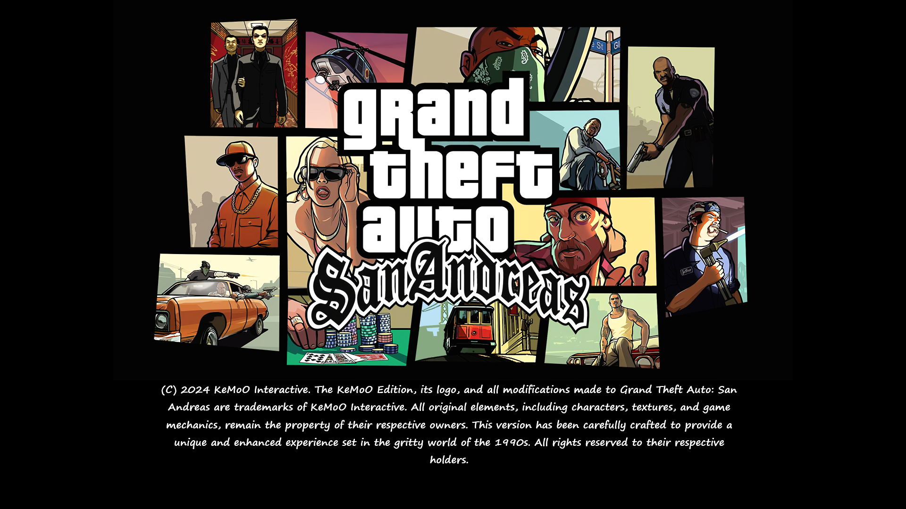
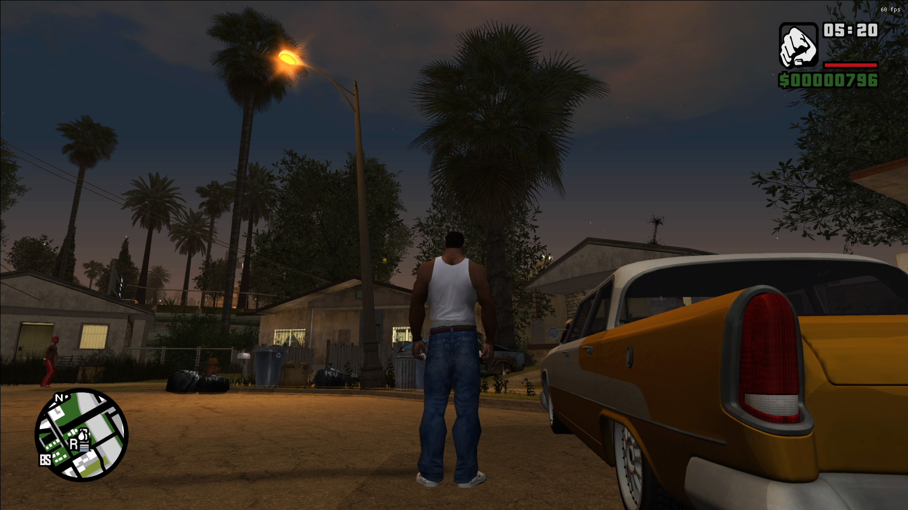
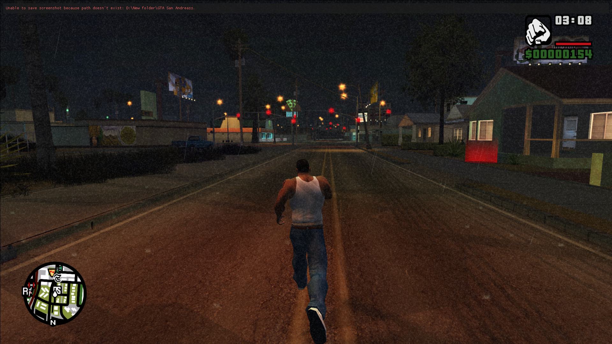
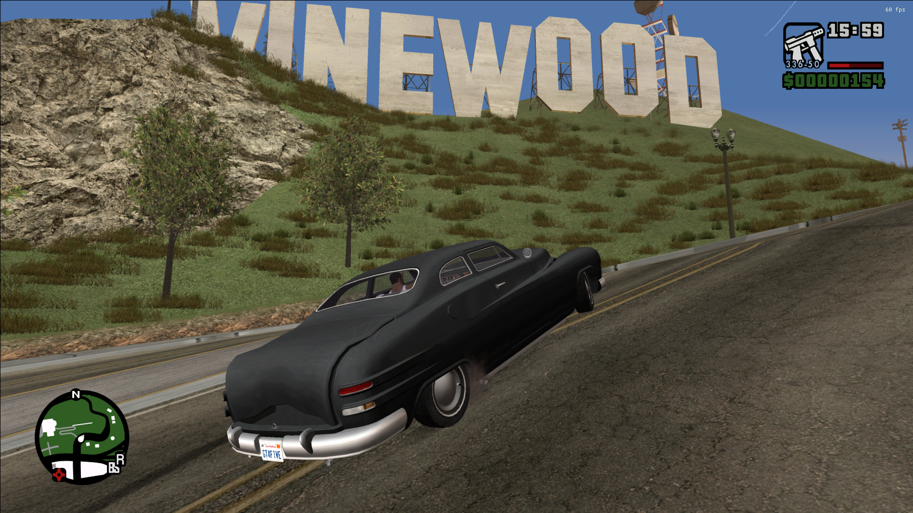
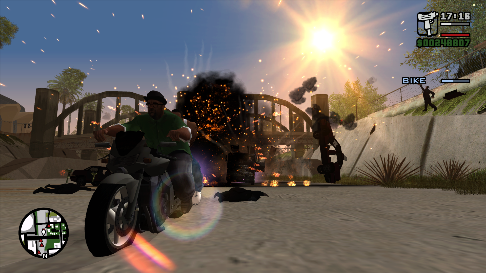
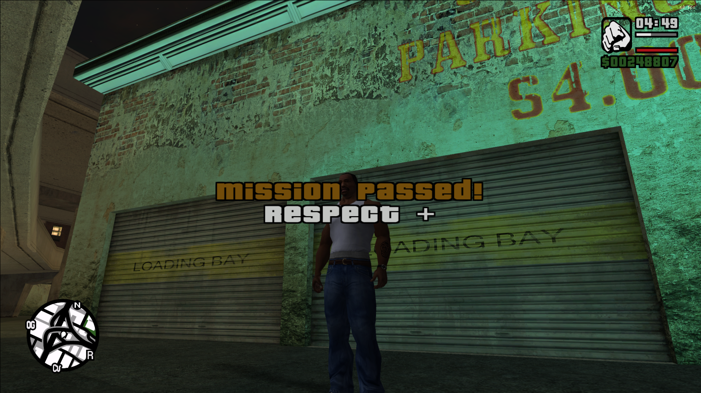
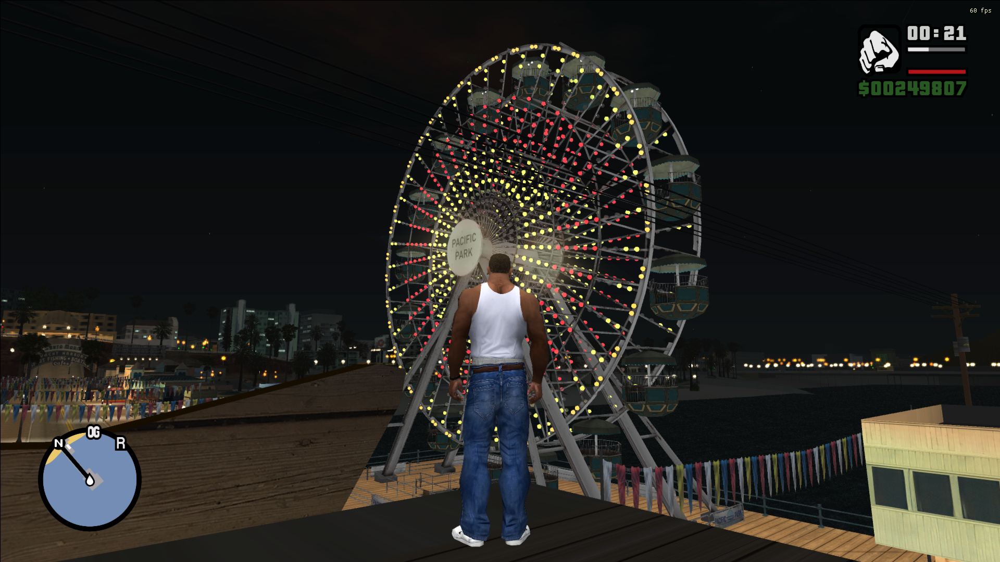
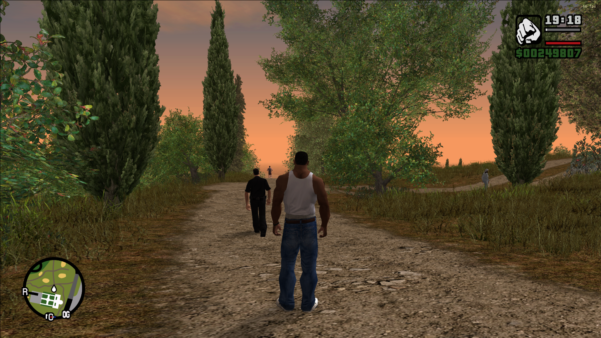

# 🎮 GTA: San Andreas – KeMoO Edition

### Version 5 · The 1990s spirit, reborn with a modern twist

**An immersive total-conversion mod that upgrades graphics, gameplay, audio and the entire map of Grand Theft Auto: San Andreas, while fully respecting Rockstar's rights.**

[Features](#-features) · [Screenshots](#-screenshots) · [Installation](#-installation-guide) · [Requirements](#-system-requirements) · [Guides](#-guides--documents) · [Tips](#-tips-for-optimal-performance) · [Modding](#-learn-to-mod) · [Contact](#-contact)

---

## 📖 About

Welcome to the **KeMoO Edition (V. 5)** of *Grand Theft Auto: San Andreas*!

This mod revives the classic **1990s spirit** with a modern twist. It enhances the graphics, gameplay and audio to deliver an innovative, immersive and exciting experience in the world of San Andreas, all while fully respecting Rockstar's rights.

---

## ✨ Features

| | Category | What's new |
|---|---|---|
| 🖼️ | **Graphics Enhancement** | Upgraded graphics quality to meet modern standards, with support for up to **4K resolution**. All in-game textures updated to reflect the 1990s aesthetics. |
| 🚗 | **Vehicles & Weapons** | All vehicles replaced with **1990s-style models** for a historical feel, plus new cars. Weapons redesigned with more variety and realism for modern gameplay. |
| 🔊 | **Audio Enhancements** | Revamped soundtrack and environmental sounds (including weather, lighting and shadows) for a richer auditory experience. Improved audio quality to complement the upgraded graphics. |
| ⏳ | **Loading Screens** | New loading screens that match the enhanced visuals with a unique 1990s touch. |
| 🏃 | **Movement & Game Engine** | Refined character and vehicle movement mechanics for smoother gameplay. Optimized engine for stable performance and fewer errors. |
| 🗺️ | **Map Rebuild** | The entire map has been completely reimagined and rebuilt with new buildings and locations. |
| 🤖 | **Additional Features** | Enhanced AI for vehicles and pedestrians, adding dynamic open-world interactions. New 1990s-inspired vehicles and characters, preserving the original spirit. |

---

## 📸 Screenshots

  
  

  
  

View more screenshots

  
  

  
  

Browse every image in the [images folder](./images).

---

## 🚀 Installation Guide

> [!IMPORTANT]
> This mod requires a **legitimate copy** of the original GTA: San Andreas. The game itself is **not** included.

1. **Download** the original GTA San Andreas from a trusted source.
2. **Back up** the original game files.
3. **Extract** the KeMoO Edition files using **WinRAR**.
4. **Copy** the extracted mod files into the game's main directory, replacing files only when the mod's instructions require it.
5. **Run the game as administrator** via **Compatibility Mode** if needed.

---

## ⚡ Tips for Optimal Performance

- ✅ Keep an **original copy** of the game before installing the mod.
- ✅ Run the game **as administrator** with compatibility settings.
- ✅ If you hit EXE issues, **re-extract the files properly** using WinRAR.
- ✅ **Avoid modifying core files** beyond the mod's installation instructions.
- ✅ **Update your graphics drivers** for the best visual experience.
- ✅ Verify your system meets the **recommended specs**.

---

## 💻 System Requirements

| Component | Minimum | Recommended |
|---|---|---|
| **OS** | Windows 7 / 8 / 10 / 11 (64-bit) | Windows 10 / 11 (64-bit) |
| **Processor** | Intel Core i5-3470 | Intel Core i7-4790 |
| **RAM** | 8 GB | 16 GB |
| **Graphics** | NVIDIA GTX 660 or equivalent | NVIDIA GTX 1050 or equivalent |
| **Storage** | 20 GB free space | 20 GB free space |

---

## 📚 Guides & Documents

| Document | Link |
|---|---|
| 🇬🇧 GTA San Andreas Guide (English) | [Open PDF](./GTA%20San%20Andreas%20(en).pdf) |
| 🇪🇬 دليل GTA San Andreas (العربي) | [Open PDF](./GTA%20San%20Andreas%20(AR).pdf) |
| 🗺️ Hidden Places Guide | [Open PDF](./Hidden%20places.pdf) |
| 🛠️ Create Your Own GTA SA Mod | [Open guide](./How%20to%20Create%20Your%20Own%20GTA%20SA) |

---

## 🛠️ Learn to Mod

Want to create your own San Andreas mods? Check out the
**[Modding Guide](./How%20to%20Create%20Your%20Own%20GTA%20SA)** for step-by-step instructions.

---

## 🤝 Mod Rights

All rights reserved to the original mod creators. We respect the intellectual property of all contributors to ensure a unique KeMoO experience.

---

## 📄 License

This project is licensed under the **MIT License**. See the [LICENSE](./LICENSE.txt) file for details.

---

## 📬 Contact

For support or feedback, reach out at **[karemalwy1@gmail.com](mailto:karemalwy1@gmail.com)**.

Created with ❤️ by [**Kareem Basem**](https://github.com/Kareem-Basem)

---

## ⚖️ Legal Notes

- For **personal use only**.
- All rights to the original game belong to **Rockstar Games**.
- KeMoO Edition is an **unofficial mod**, not supported or endorsed by Rockstar.

---

### 🚗💥 Enjoy the Ultimate San Andreas Experience!

⭐ If you like this project, don't forget to **star** the repo!

